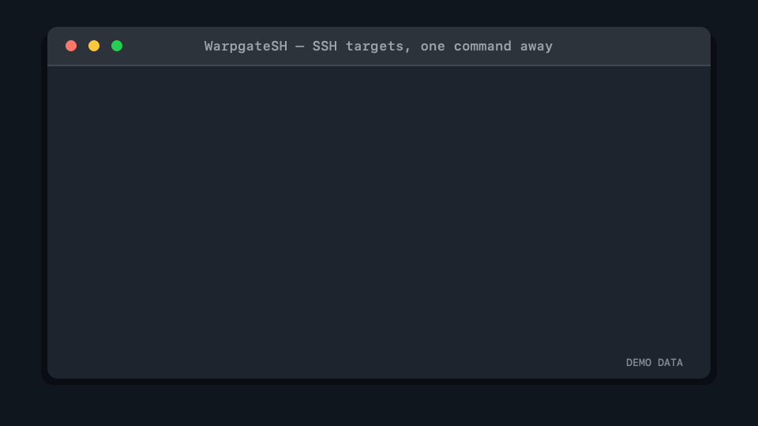

# WarpgateSH

[](https://github.com/M0okz/warpgatesh/actions/workflows/ci.yml)
[](https://github.com/M0okz/warpgatesh/releases/latest)
[](LICENSE)

**A CLI-first desktop companion that keeps your SSH access in sync with
[Warpgate](https://github.com/warp-tech/warpgate).**

WarpgateSH turns the SSH targets available to you in Warpgate into local,
memorable OpenSSH aliases. Add an instance once, let the background agent keep
it synchronized, then connect with `warpgatesh <target>` or your usual SSH
tools.

> [!IMPORTANT]
> WarpgateSH is an independent, unofficial community project. It is not
> affiliated with, endorsed by, or supported by the Warpgate maintainers.
> Warpgate itself does not require a client application; WarpgateSH is an
> optional convenience layer for people who prefer a synchronized local SSH
> workflow.



_The instance, target names, and terminal session shown above are demo data._

## Why WarpgateSH?

[Warpgate](https://warpgate.null.page/) is a self-hosted bastion and privileged
access management platform for SSH, HTTPS, Kubernetes, databases, RDP, and VNC.
It centralizes authentication, role-based access, and auditing while remaining
transparent to standard protocol clients.

WarpgateSH focuses on one small part of that ecosystem: making a user's
authorized **SSH targets** feel native on their workstation.

- Discover only the SSH targets available to your Warpgate user.
- Generate short aliases for a default profile and qualified aliases for every
  profile.
- Keep managed SSH configuration separate from your hand-written config.
- Delegate every connection to the system OpenSSH client.
- Continue using the last successful snapshot when Warpgate is temporarily
  unavailable.
- Manage multiple Warpgate instances from one workstation.

WarpgateSH does not administer Warpgate users, roles, or targets, and it does
not replace Terraform, Ansible, or the
[official Terraform provider](https://github.com/warp-tech/terraform-provider-warpgate).

## Quick start

WarpgateSH currently targets **macOS 13 or newer**, on both Apple silicon and
Intel Macs. Download the universal DMG from the
[latest release](https://github.com/M0okz/warpgatesh/releases/latest), move
WarpgateSH to Applications, and open it.

The graphical companion can install the bundled CLI from its preferences. It
never needs to stay open: synchronization is handled independently by a
per-user background agent.

Add a profile for your Warpgate instance:

```console
$ warpgatesh profile add lab https://warpgate.example.com
```

WarpgateSH opens the personal API-token page in your browser, validates the
token you paste into the terminal, and asks you to verify the SSH host keys
before pinning them. The token is stored in the macOS Keychain and is never used
as an SSH credential.

Then synchronize and connect:

```console
$ warpgatesh sync
Synchronized 3 SSH target(s) from 1 profile(s): +3, -0

$ warpgatesh ls
app-01       lab    Application server
db-primary   lab    PostgreSQL primary

$ warpgatesh app-01
```

Pass regular OpenSSH arguments after `--`:

```console
$ warpgatesh app-01 -- -L 8080:localhost:80
```

Because WarpgateSH generates standard OpenSSH configuration, compatible tools
can also use the managed aliases directly:

```console
$ ssh app-01
$ scp ./backup.tar app-01:/tmp/
```

## Commands

| Command | Purpose |
| --- | --- |
| `warpgatesh profile add <name> <url>` | Add or replace a Warpgate profile |
| `warpgatesh profile list` | List configured profiles |
| `warpgatesh profile default <name>` | Choose which profile provides short aliases |
| `warpgatesh login <profile>` | Replace a personal API token |
| `warpgatesh ls` | List synchronized SSH targets and their aliases |
| `warpgatesh sync` | Request an immediate synchronization |
| `warpgatesh status` | Show profile, snapshot, and agent status |
| `warpgatesh <target>` | Connect to a target through the system OpenSSH client |
| `warpgatesh doctor` | Diagnose the local installation |
| `warpgatesh agent install` | Install and start the background agent |

Run `warpgatesh help` for the complete built-in reference.

## How it works

```text
Warpgate user API
       │ authorized SSH targets
       ▼
WarpgateSH agent ──► atomic local snapshot
       │                    │
       │                    └─► ~/.ssh/warpgatesh/config
       │
       ├─► macOS Keychain (personal API tokens)
       └─► pinned Warpgate SSH host keys
                                │
warpgatesh <target> ────────────┴─► /usr/bin/ssh
```

The agent synchronizes all configured profiles at login, after wake or network
recovery, and periodically in the background. A failed synchronization never
replaces a valid snapshot with an empty or partial one.

WarpgateSH adds a single managed directive to `~/.ssh/config`:

```sshconfig
Include ~/.ssh/warpgatesh/config
```

Everything else it owns stays under `~/.ssh/warpgatesh/` and the user's
WarpgateSH application-support directory. Existing manual SSH entries take
precedence; WarpgateSH does not overwrite them.

When several profiles contain similarly named targets, qualified aliases keep
them unambiguous:

```console
$ warpgatesh profile default production
$ ssh api.production
$ ssh api.staging
```

## Security and privacy

- Personal API tokens are stored in the macOS Keychain, not in Git, shell
  configuration, or generated SSH files.
- Warpgate SSH host keys are explicitly approved and pinned per profile.
- Generated files are replaced atomically only after a complete successful
  synchronization.
- Connections are executed by `/usr/bin/ssh`; WarpgateSH does not implement its
  own SSH client or retain SSH authentication secrets.
- There is no telemetry and no automatic crash reporting.
- Diagnostics stay local and are designed to exclude tokens, passwords, and
  private keys.

Please report vulnerabilities privately through
[GitHub Security Advisories](https://github.com/M0okz/warpgatesh/security/advisories/new).

## Project status

WarpgateSH is an early community release. The current supported desktop
experience is macOS; the Rust core and CI are kept portable, with Linux desktop
support planned after the macOS workflow has matured.

The project currently includes:

- the `warpgatesh` command-line client;
- a per-user synchronization agent;
- a lightweight macOS menu-bar companion;
- signed, notarized universal macOS release artifacts;
- multi-profile target synchronization and deterministic SSH aliases.

See the [architecture decisions](docs/adr/) for the product and security
rationale behind the implementation.

## Build from source

Requirements:

- Rust 1.85 or newer;
- macOS 13 or newer for the complete desktop experience;
- Node.js 22 and npm to build the graphical companion.

Build and test the Rust workspace:

```sh
git clone https://github.com/M0okz/warpgatesh.git
cd warpgatesh
cargo build --workspace
cargo fmt --all -- --check
cargo test --workspace
cargo clippy --workspace --all-targets -- -D warnings
```

Install the CLI and agent from the checkout:

```sh
cargo install --path crates/warpgatesh-cli --locked
cargo install --path crates/warpgatesh-agent --locked
warpgatesh agent install
```

Build the macOS companion:

```sh
cd apps/warpgatesh-companion
npm ci
npm run tauri build -- --bundles app
```

Release maintainers can find the signing, notarization, and packaging process
in [docs/releasing-macos.md](docs/releasing-macos.md).

## Contributing

Issues, documentation improvements, compatibility reports, and pull requests
are welcome. Before proposing a large change, open an issue so the approach can
be discussed with the community.

When contributing code, please run the Rust checks above. Changes to the macOS
companion should also pass:

```sh
cd apps/warpgatesh-companion
npm ci
npm run build
npm run test:sidecars
```

## Acknowledgements

WarpgateSH exists because of the
[Warpgate](https://github.com/warp-tech/warpgate) project and its contributors.
Please use the official [Warpgate documentation](https://warpgate.null.page/)
for server installation, administration, supported protocols, and security
guidance.

WarpgateSH is licensed under the [Apache License 2.0](LICENSE).
